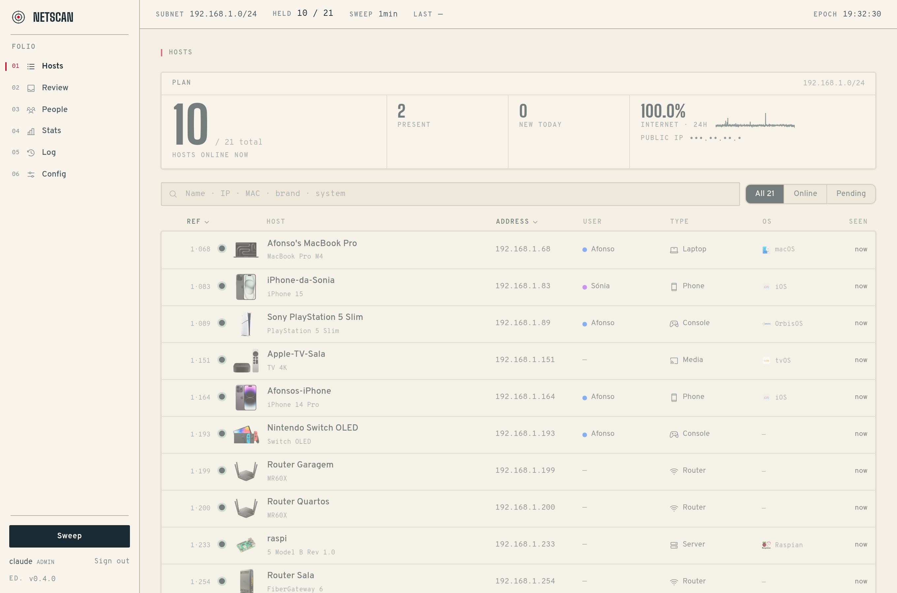
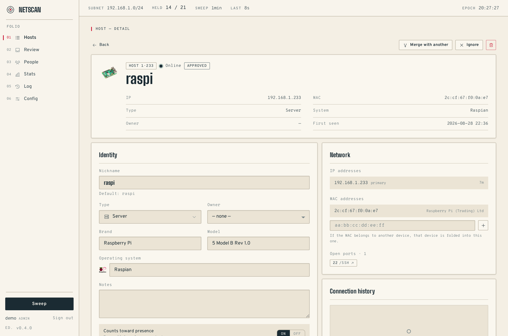
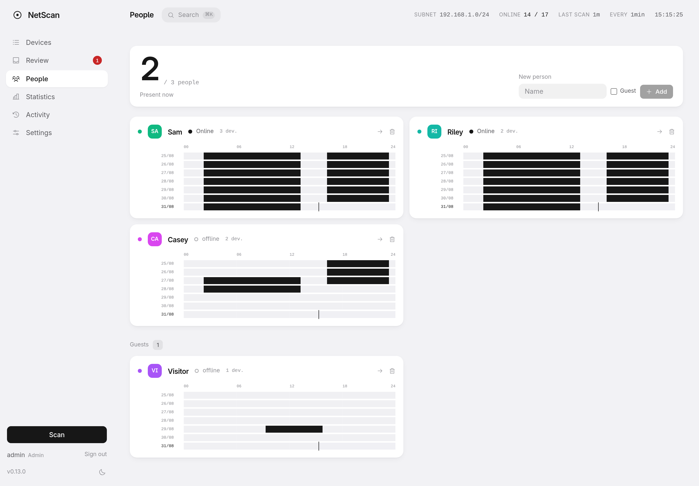
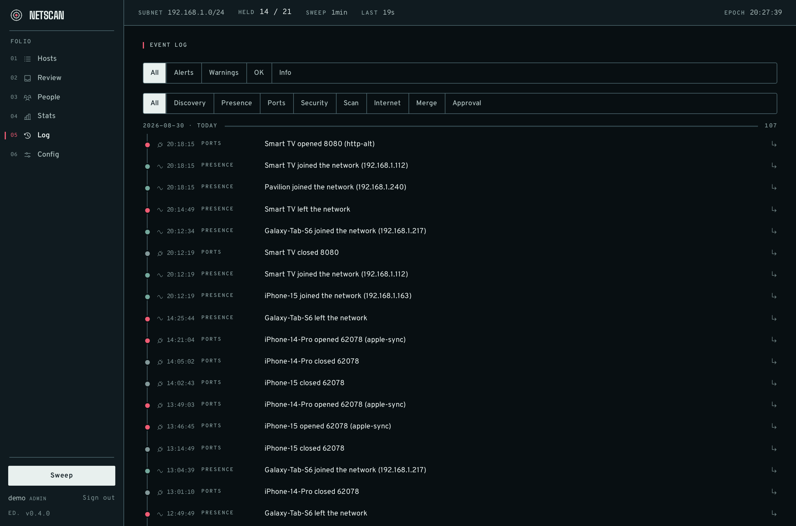
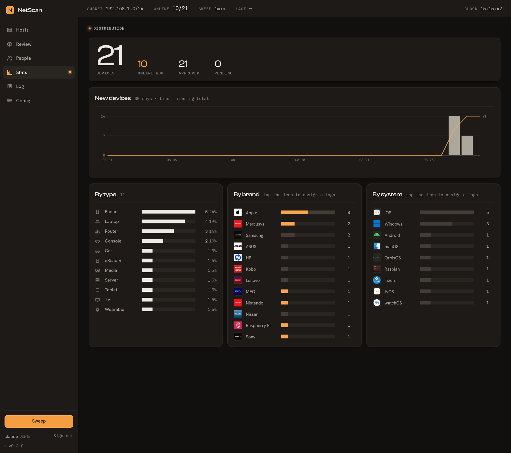

<p align="center">
  
</p>

<p align="center">
  <a href="https://github.com/nobrega8/cherubyte/actions/workflows/ci.yml"></a>
  <a href="https://github.com/nobrega8/cherubyte/actions/workflows/agent-windows.yml"></a>
  <a href="LICENSE"></a>
  
  
  
</p>

<h1 align="center">Your whole network, in one quiet place.</h1>

<p align="center">
  Cherubyte watches every device on your LAN, works out what each one is,<br>
  remembers when it comes and goes, and tells you the moment something new appears.<br>
  Self-hosted. No account. No cloud. A free, private alternative to Fing.
</p>

<p align="center">
  
</p>

---

## What it does

**Everything at a glance.** Open the panel and you know, in seconds, what's online
now, who's home, what's new since last time, and whether anything needs a look.

**It knows what things are.** Reverse DNS, mDNS, SSDP, NetBIOS, HTTP banners, TCP
fingerprints, MAC vendor, passive DHCP fingerprinting, an optional
[Fingerbank](https://fingerbank.org/) lookup and TTL hints combine into a type,
a brand and an OS for each device — phone, laptop, TV, console, camera, NAS,
router, and the rest.

**One device, however many addresses.** Randomised MACs and multiple IPs fold
into a single identity, so a phone that rotates its MAC is one row, not five.

**It remembers who's home.** Link devices to people and get a per-hour grid of
when each person was on the network. Always-on devices can sit it out.

**It speaks up when it should.** New devices land in a review queue. A rogue DHCP
server, a gateway MAC that changes, a known device that starts presenting a
different OS, a sensitive port opening up — each raises an alert, pushed to
Telegram or [ntfy](https://ntfy.sh/) with a quiet-hours window and Approve /
Ignore buttons right on the notification.

**Private by design.** It runs on hardware you already own. The inventory lives
in a SQLite file on your LAN and never leaves it.

<details>
<summary>Everything else it does</summary>

- **Connection history & activity log** — every join, leave, port change and
  alert, searchable and filterable.
- **Statistics** — new devices per day; the network broken down by type, brand
  and OS, with logos you can assign.
- **Internet monitoring** — WAN uptime and latency with a sparkline, an alert on
  the transition, and your public IP shown redacted until you hover it.
- **Home Assistant via MQTT** — auto-discovery turns each person into a
  `device_tracker` and each device into a connectivity sensor.
- **Prometheus** — a `/api/metrics` scrape endpoint (device counts, per-person
  presence, agent freshness, WAN state), optionally behind a token.
- **Multiple subnets** — scan several CIDRs; each gets its own tab.
- **Per-device photos** — snap a picture so you recognise the thing later.
- **Wake-on-LAN** — a Wake button on an offline device; the agent on that
  segment sends the magic packet.
- **CSV export** — the whole device inventory from **Settings ▸ History**.
- **SNMP · topology** (opt-in) — name managed switches from their `sysDescr` and
  read the links between them from the LLDP-MIB.
- **Risky-port watchlist** — a database, a remote shell or an unauthenticated
  admin API answering on the LAN gets a louder alert and a mark on the device.
- **Merge suggestions** for phones that rotate their MAC, and a weekly digest.
- English or Portuguese, light or dark — a tap to switch either.
</details>

<table>
  <tr>
    <td width="50%"><br><sub><b>Device</b> — rename it, set its owner and type, see every IP and MAC folded in, and its join/leave history.</sub></td>
    <td width="50%"><br><sub><b>People</b> — link devices to people; a per-minute strip of when they were home.</sub></td>
  </tr>
  <tr>
    <td width="50%"><br><sub><b>Activity</b> — every join, leave, port change and alert, filterable by level and category.</sub></td>
    <td width="50%"><br><sub><b>Statistics</b> — new devices over time, and the network broken down by type, brand and OS.</sub></td>
  </tr>
</table>

<sub>Screens show a generic demo network. Light by default, dark on a tap; English or Portuguese.</sub>

---

## Why not just use Fing?

[Fing](https://www.fing.com/) is a polished app, but the useful parts — device
detail, presence history, custom alerts, more than a handful of devices — are
behind a paid subscription, and everything syncs through Fing's cloud with an
account attached.

Cherubyte does the same job on your own hardware.

| | Cherubyte | Fing (free) | Fing Premium |
| --- | --- | --- | --- |
| Price | Free | Free | Paid subscription |
| Runs | On your own machine | Phone / cloud | Phone / cloud |
| Account | One, local to your box | Fing cloud account | Fing cloud account |
| Where your data lives | Your LAN, in SQLite | Fing's cloud | Fing's cloud |
| Device limit | None | Limited | Higher |
| Presence history per person | Yes | — | Limited |
| New-device alerts | Telegram / ntfy | — | Yes (Fing's channels) |
| Open source | Yes | No | No |
| Always-on | Yes, it's a service | Only while the app scans | Fingbox hardware |

---

## Two halves

Cherubyte is a **panel** and one or more **agents**, and the split is the point.

An **agent** sits on the network it watches and does the scanning — an ARP sweep,
mDNS, SSDP, the kernel's neighbour table — which needs raw sockets and a place on
that LAN. It holds nothing but its own key.

The **panel** stores the history, classifies devices, raises alerts and serves
the web UI on port **1001**. It needs no privileges and never touches a monitored
network, so it can live anywhere — a Raspberry Pi, a NAS, someone else's box.

Everything crossing the wire is something an agent *saw*. Naming, presence and
alerting are the panel's, computed from those observations — so improving any of
them is a panel upgrade that reaches every agent already in the field.

---

## Get started

```bash
git clone https://github.com/nobrega8/cherubyte.git
cd cherubyte

# builds the panel + the bundled agent, creates the database,
# prompts for an admin account, installs both as systemd services
./scripts/setup.sh --service --agent
```

Then open **<http://localhost:1001>**, sign in, and enrol the agent:

1. **Settings ▸ Agents ▸ New agent** — copy the token.
2. `./scripts/install-agent-service.sh http://localhost:1001 <token>`

The first scan lands a few seconds later. Cherubyte does not scan until an agent
is enrolled and reporting.

```bash
sudo systemctl {status,restart,stop} cherubyte          # the panel
sudo systemctl {status,restart,stop} cherubyte-agent    # the scanner
journalctl -u cherubyte -f
```

Reset a lost admin password with `cd backend && .venv/bin/python manage.py
create-admin <name>`. Back up everything — the database and the uploads — from
**Settings ▸ History** or `manage.py backup`.

<details>
<summary>Docker</summary>

Two containers, `ghcr.io/nobrega8/cherubyte-panel` and `-agent`, multi-arch
(`amd64` + `arm64`).

```bash
docker compose up -d panel              # panel on http://<host>:1001
# in the panel: Agents → new token, then:
AGENT_ENROL_TOKEN=<token> docker compose up -d agent
```

The agent runs `network_mode: host` (required for layer-2 discovery) with
`NET_RAW` / `NET_ADMIN`; the panel is an ordinary bridge with no capabilities.
Keep the agent's state volume — without it the agent re-enrols on every restart,
and the second restart fails because the token is already spent.

Docker Desktop on macOS/Windows won't do for the agent: even with host
networking the "host" is the Linux VM. The panel is fine anywhere.
</details>

<details>
<summary>Installing an agent (Linux · Docker · Windows)</summary>

An agent needs two things: a panel URL and an enrolment token that panel minted.
Everything else is configured in the panel and sent back with every report.
Mint a token in **Settings ▸ Agents** — the page prints the exact command for
each method, filled in.

**Linux / Raspberry Pi** (from a clone of this repo):

```bash
./scripts/install-agent-service.sh http://your-panel:1001 <token>
```

Creates `agent/.venv`, writes `agent/.env`, installs a `cherubyte-agent` systemd
unit with `CAP_NET_RAW` and no root. The key lives in
`~/.local/state/cherubyte-agent/`.

**Docker** (Linux host):

```bash
docker run -d --name cherubyte-agent --network host \
  --cap-add NET_RAW --cap-add NET_ADMIN \
  -v cherubyte-agent:/var/lib/cherubyte-agent \
  -e CHERUBYTE_AGENT_PANEL_URL=http://your-panel:1001 \
  -e CHERUBYTE_AGENT_ENROL_TOKEN=<token> \
  ghcr.io/nobrega8/cherubyte-agent:latest
```

**Windows** — download `cherubyte-agent.exe` from the releases page, then from an
elevated PowerShell:

```powershell
.\install-service.ps1 -PanelUrl http://your-panel:1001 -EnrolToken <token>
```

Installs to Program Files, registers a service, keeps its key in ProgramData.
`.\uninstall-service.ps1` removes it.

The token is single-use, valid 24 h, spent once on first start for a long-lived
key of which the panel stores only a hash. Agents push outbound over HTTP —
nothing needs to be opened on the network the agent sits on, and pointing one at
someone else's panel is just a different `CHERUBYTE_AGENT_PANEL_URL`.
</details>

<details>
<summary>Running the panel without systemd</summary>

The ARP scan and binding port 1001 both need network privileges. The systemd
unit is the recommended path; otherwise:

```bash
# capabilities on the venv's python (a real file, not a symlink)
sudo setcap 'cap_net_raw,cap_net_admin,cap_net_bind_service+eip' \
  "$(readlink -f backend/.venv/bin/python)"

# ...or run as root
sudo backend/.venv/bin/python backend/run.py
```

- `./scripts/start.sh` — production, everything on `:1001`
- `./scripts/dev.sh` — backend on `:1001` + Vite dev server on `:5173`
</details>

---

## Requirements

- Linux (developed on a Raspberry Pi; anything with Python 3.11+)
- Python 3.11+ and Node.js 20+ to build
- The agent needs `CAP_NET_RAW`; the panel needs `CAP_NET_BIND_SERVICE` for port
  1001 — the systemd units grant both without root
- Optional: `snmp` (net-snmp) on the agent's host for SNMP queries — bundled in
  the Docker image, `apt install snmp` otherwise

---

## Configuration

Everything is editable in **Settings** and stored in the database; `backend/.env`
(`CHERUBYTE_*`, see `.env.example`) sets the initial values. Scan-related settings
are pushed to every agent with each report.

- **Subnets** — empty auto-detects the agent's `/24`, or list CIDRs. ARP only
  reaches the agent's own link; routed subnets fall back to ping + the OS ARP
  table and may be partial.
- **Scan interval / offline-after / re-identify interval** — discovery runs every
  scan; the heavier identification is spaced out, immediate for new devices.
- **History retention** — event and connection tables are purged daily; default
  90 days, `0` keeps everything.
- **Notifications** — Telegram and/or ntfy. On a public ntfy server anyone who
  knows the topic can read your alerts, so pick something unguessable.
- **Fingerbank API key** — free from fingerbank.org; turns DHCP fingerprints
  into a device name and OS.

---

## Architecture

```
backend/   FastAPI + APScheduler + SQLAlchemy (async)   the panel  → :1001
frontend/  React + TypeScript + Vite + Tailwind         the web UI
agent/     FastAPI + scapy + zeroconf                    the scanner → :1002 (health only)
protocol/  pydantic models — the agent↔panel wire contract
```

The panel serves the API at `/api/*`, an SSE feed at `/api/stream`, uploads at
`/uploads/*`, and the compiled SPA for everything else. Agents push reports to
`/api/agents/{id}/report` and never listen for the panel.

---

## Security

- **Authentication** — first launch creates an admin account; after that the UI
  and the write API are behind a login. Passwords are PBKDF2-HMAC-SHA256 (600k
  rounds, stdlib); a session is an opaque `httponly` cookie looked up in a table,
  so logout is a row delete. Failed logins are throttled per username. Three
  roles: **viewer**, **editor**, **admin**.
- **Agents** carry a single-use enrolment token, spent once for a long-lived key
  the panel stores only as a hash.
- **API tokens** — `nsk_`-prefixed bearer tokens for scripts, stored hashed,
  shown once, always read-only.
- The SPA fallback only serves files inside `frontend/dist`; uploads are
  size-capped, validated by their leading bytes, and served under a locked-down
  CSP. CORS is off by default.

Still — don't put Cherubyte directly on the public internet. A VPN or an
authenticating reverse proxy in front is the right posture.

---

## Development

```bash
cd backend  && .venv/bin/pytest      # panel tests, no network
cd agent    && .venv/bin/pytest      # agent tests
cd frontend && npm run build         # runs tsc --noEmit first
```

All run in CI on every push and pull request. See
[`docs/DECISIONS.md`](docs/DECISIONS.md) for why the system is shaped the way it
is — each entry anchored to the failure that produced it.

---

## Roadmap

**Before 1.0**

- **Cut the first release** — the GHCR images and semver tags are wired up in CI
  but no release has been cut, so `docker compose up` needs a `build` first until
  one is (`docs/RELEASING.md`).
- **Deploy the site** (`site/`, Cloudflare) and run the Windows agent on real
  hardware once — it's CI-tested but never hand-installed.

**Ideas**

- A topology map (the LLDP edges are already collected at `/api/topology`)
- Passive discovery alongside the active ARP sweep
- Alembic for non-additive migrations

---

## License

[MIT](LICENSE). The UI font is [Inter](https://rsms.me/inter/) under the SIL Open
Font License 1.1, self-hosted in `frontend/public/fonts/` with its license file
next to it. Cherubyte makes no external font requests.
